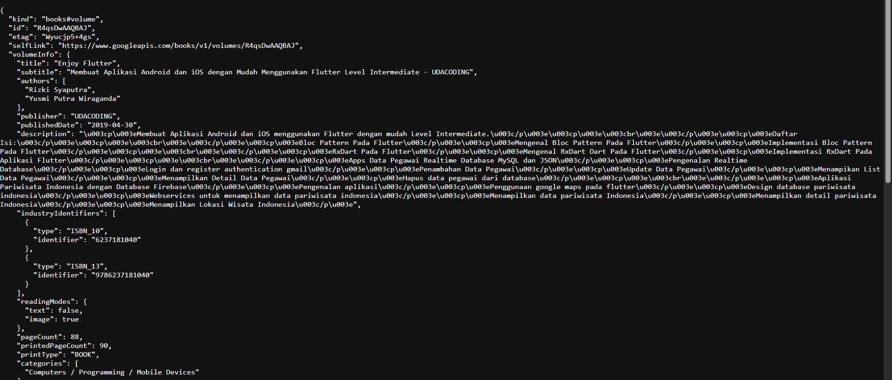
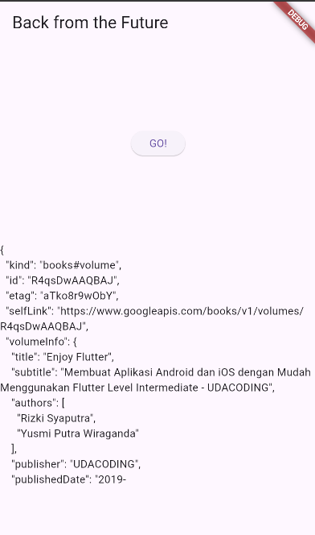
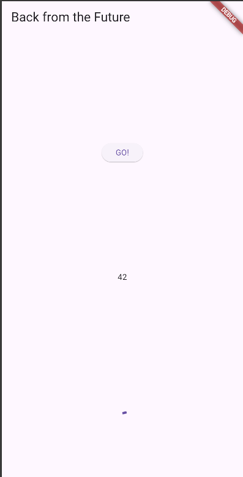
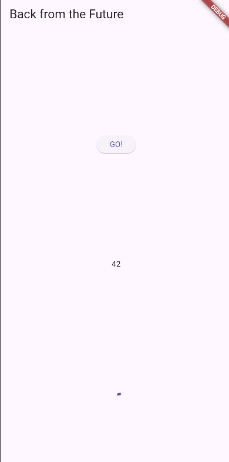
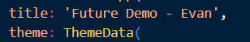

# books

A new Flutter project.

## Praktikum 1
**soal 2**

https://www.googleapis.com/books/v1/volumes/R4qsDwAAQBAJ

Berhasil menampilkan data JSON dari Google Books API.

**soal 3**

.substring(0, 450) adalah metode String yang digunakan untuk memotong atau mengambil sebagian dari String asli.

.catchError() adalah cara standar dalam Dart untuk menangani kesalahan (error) yang mungkin terjadi saat Future tersebut dijalankan.

## Praktikum 2
**soal 4**

Langkah 1: Kode ini membuat tiga fungsi asinkron yang masing-masing memiliki jeda 3 detik sebelum mengembalikan nilai 1, 2, dan 3.

Langkah 2: Kode ini menjalankan tiga operasi asinkron secara berurutan (sequential), dengan total penundaan 9 detik, dan menampilkan hasil penjumlahannya (6) setelah semua selesai.

## Praktikum 3
**soal 5**

Kode ini menunjukkan alternatif non-tradisional untuk membuat dan mengontrol Future di Dart.

- getNumber() memulai proses dan memberikan "janji" (Future) yang belum selesai.

- calculate() bekerja di latar belakang (selama 5 detik).

- Setelah 5 detik, calculate() secara manual "memenuhi" janji tersebut dengan nilai 42.

- Kode di onPressed() yang menunggu getNumber().then(...) akan menerima nilai 42 setelah 5 detik berlalu.

**soal 6**

Langkah 2 hanya mengurus skenario sukses dan akan menggantung jika terjadi error.

Kode Langkah 5 & 6 membangun alur penanganan kesalahan yang lengkap:

- Langkah 5 memastikan Future selalu selesai, baik dengan sukses (complete) atau gagal (completeError).

- Langkah 6 memastikan pemanggil (UI) dapat menangani kedua hasil tersebut, yaitu menampilkan data jika sukses (.then) atau menampilkan pesan error jika gagal (.catchError).

## Praktikum 4
**soal 7**

**soal 8**

Langkah 4 adalah penyederhanaan (refactor) dari Langkah 1. Keduanya sama-sama menjalankan tiga fungsi (returnOneAsync, returnTwoAsync, returnThreeAsync) secara paralel/bersamaan.

## Praktikum 5
**soal 9**

**soal 10**

Langkah 1 adalah cara klasik untuk menangani Future sebelum async/await ada.

Langkah 4 (async/await) adalah cara yang lebih modern, bersih, dan mudah dibaca karena memungkinkan untuk menangani error asinkron menggunakan sintaks try...catch

## Praktikum 6
**soal 11**

**soal 12**

Plugin geolocator memiliki implementasi khusus untuk web. Saat menjalankannya di browser, plugin ini tidak mengakses chip GPS perangkat secara langsung (seperti di HP).

## Praktikum 7
